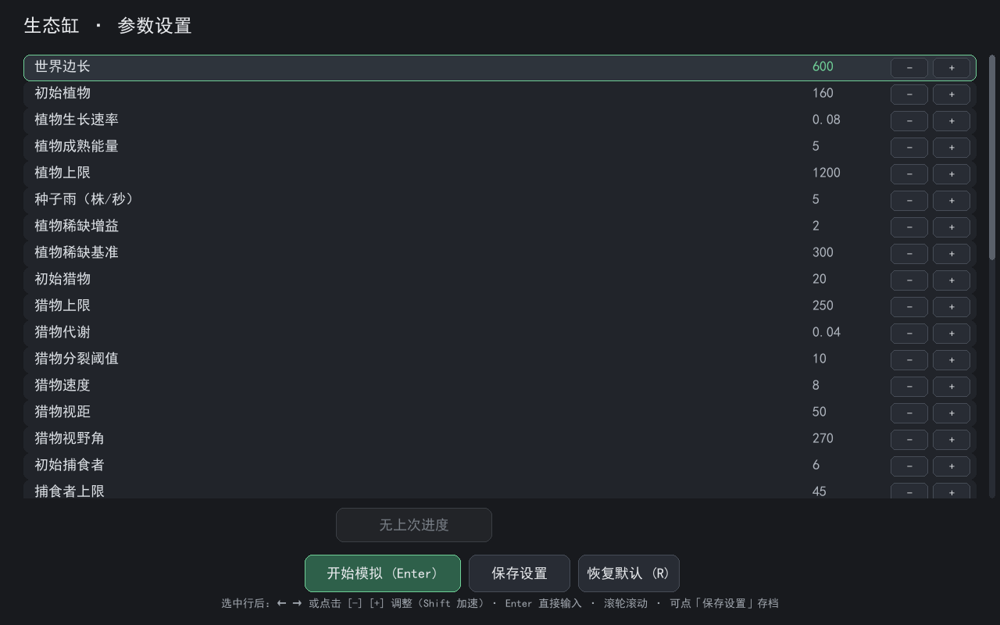
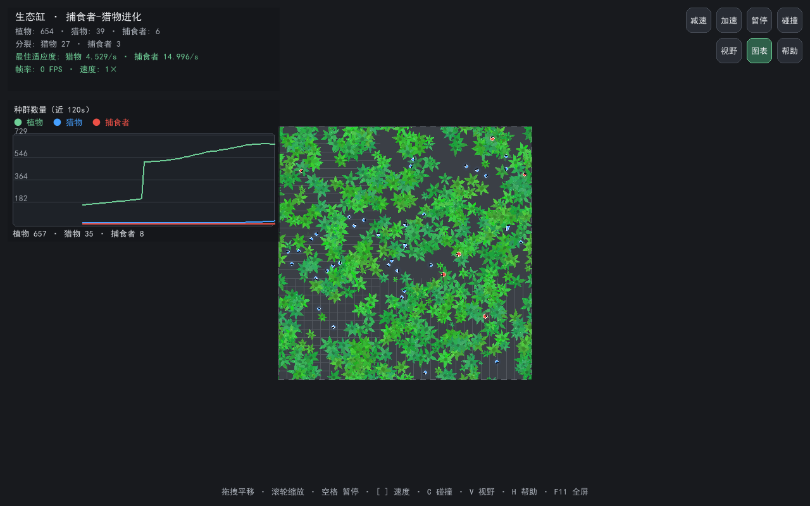
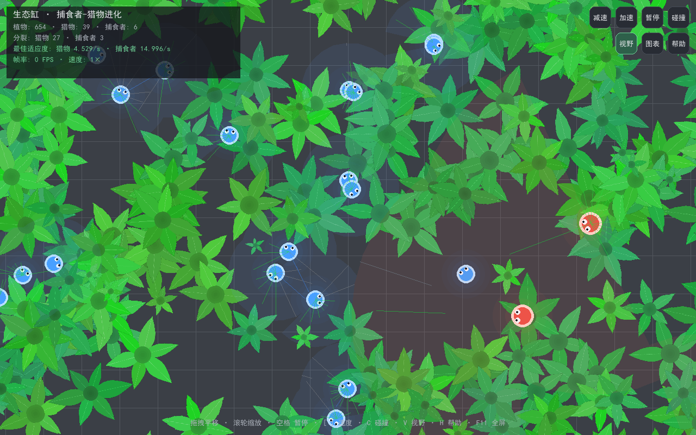
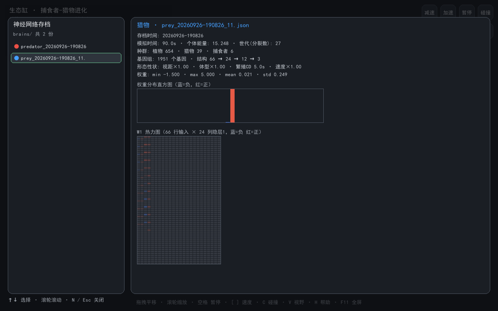
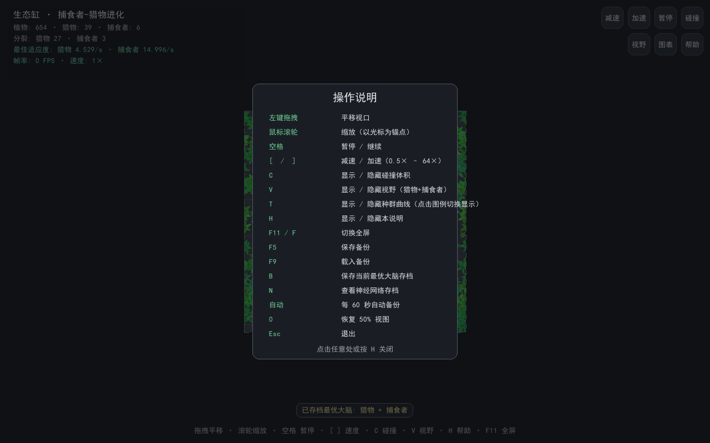

# 生态缸 · 捕食者-猎物进化模拟

> 基于**神经网络**与**遗传算法**的捕食者-猎物协同进化模拟系统。
> 在一个带环绕边界的虚拟生态缸中，植物、猎物（食草者）与捕食者（肉食者）共存，
> 智能体的觅食、逃跑、追击、伏击、冲刺、躲藏乃至同类相食等行为**全部由进化自发产生**，
> 并形成可长期观察的**进化军备竞赛**。

技术栈：Python 3.14 · pygame-ce · NumPy · PyInstaller（单文件 exe）

---

## 截图

| 启动参数设置屏 | 模拟主界面（含种群曲线） |
| --- | --- |
|  |  |

| 双物种视野显示 | 神经网络存档查看器 |
| --- | --- |
|  |  |



---

## 快速开始

### 方式一：运行源码（推荐开发用）

```bash
pip install -r requirements.txt   # pygame-ce、numpy
python main.py
```

或在 PyCharm 中打开项目根目录，直接运行 `main.py`。

### 方式二：直接运行 exe

双击 `dist\EcoTank.exe`（单文件、免安装）。首次启动稍慢（2–5 秒，单文件解压），属正常现象。

### 方式三：重新打包

```bash
pip install pyinstaller
python -m PyInstaller --noconfirm --clean --onefile --windowed --name EcoTank main.py
# 或双击 build.bat
```

---

## 操作指南

### 启动参数设置屏

程序启动后先进入设置屏，可调整约 36 项参数：

- **滚轮**滚动列表，**点击**选中某行；
- `←` / `→` 或行内 `[-]` / `[+]` 微调（`Shift` 加速 ×10），`Enter` 直接输入数值；
- **`开始模拟`（Enter）**：应用参数并进入模拟（设置自动保存，下次沿用）；
- **`保存设置`**：仅把当前参数存盘，不开始模拟；
- **`恢复默认`（R）**：还原代码默认值；
- **`继续上次进度`**：载入上次手动存档（含当时的开局设置），无缝接上上回进度。

### 模拟内操作

| 操作 | 功能 |
| --- | --- |
| 左键拖拽 / 鼠标滚轮 | 平移视口 / 缩放（以光标为锚点） |
| `空格` / `[` `]` | 暂停继续 / 减速加速（0.5× – 64×） |
| `C` | 显示 / 隐藏碰撞体积 |
| `V` | 显示 / 隐藏视野（猎物蓝色锥 + 捕食者红色锥，射线按命中物着色） |
| `T` | 显示 / 隐藏左侧**种群曲线**（点击图例可单独开关三种单位） |
| `H` | 显示 / 隐藏操作说明面板 |
| `F11` | 切换全屏 |
| `F5` / `F9` | 手动存档 / 载入（含全部基因组、适应度、种群历史与当时的开局设置） |
| `B` | 保存当前最优大脑存档（猎物+捕食者，可保留多份） |
| `N` | 打开神经网络存档查看器（元数据 / 权重统计 / 直方图 / W1 热力图 / 形态性状） |
| `0` | 恢复初始视图（地图 = 电脑全屏的 50%） |
| `Esc` | 退出 |

> 右上角按钮提供鼠标操作入口；悬停可查看功能提示。备份文件（`eco_backup.pkl` / `eco_autosave.pkl`）、
> 大脑存档（`brains/`）、设置文件（`eco_settings.json`）均位于程序工作目录。

---

## 核心机制

### 世界与植物

- **灰色网格世界**：默认 600×600（可调），地图初始占电脑全屏 50%，可全屏、缩放；
- **环绕边界（torus）**：从左边出去、右边进来，无"墙角死局"，保证捕食压力在空间上均匀；
- **植物**：程序化绘制的俯视贴图（摆动动画），初始能量 1 → 生长积累 → 成熟后停止生长并散播后代；
  - 茎部碰撞半径小（4，不计叶片），植物互挤不堆叠，**叶片遮挡视线**（猎物可藏身植物之间）；
  - **密度反馈**：植物越少能量积累越快（最高 3×），配合种子雨，食物链底部能自我修复；
  - 被吃后淡出死亡。

### 猎物（蓝色）与捕食者（红色）

| | 猎物 | 捕食者 |
| --- | --- | --- |
| 能量/繁殖 | 初始 5，达 10 分裂（能量平分、同位置出生） | 初始 8，达 12 分裂 |
| 进食 | 口器碰植物茎部 | 口器碰**体型小于自己**的猎物；也可吃更小的同类（可关） |
| 视觉 | 270°、12 射线、视距 50×（可进化） | **180° 窄锥**、视距 90×（可进化，远距离锁定） |
| 速度/角速度 | 8×（可进化）/ 180°/s | 9×（可进化）/ 150°/s |
| 特有能力 | — | **冲刺**：双倍代谢换 1.5× 速度，2s 持续 + 4s CD（何时使用由进化学习） |

### 神经网络（双层 + 记忆）

```
输入 66 维：12 射线 × (RGB + 体型) + 目标记忆(强度/方向) + 自身能量/速度/体型
          + 上一决策隐层状态反馈（递归记忆）
→ 隐层1(24, tanh) → 隐层2(12, tanh) → 输出 [线速度, 角速度, 冲刺倾向]
```

- 按固定模拟节拍（0.12s）感知+决策，高倍速下行为同样连贯；
- 目标记忆（猎物记红/捕食者记蓝，半衰期 1.2s）让追逃更持久。

### 遗传算法与进化机制

- **基因组**：网络权重（1947）+ 4 个形态性状基因（视距/体型/繁殖CD/速度），共 1951 个实数基因；
- **变异**：每个基因 5% 概率，幅度**相对 ±0–5%**（严格限制，无"突变巨兽"）；
- **稳态选择**：适应度 =（一生进食能量 + 繁殖次数×10）÷ 年龄；满员时子代**替换适应度最低的成年个体**；
- **性状代价**：体型/速度/视距越大，代谢与繁殖成本越高——军备竞赛有攻有守；
- 初代携带手写"本能"暖启动；灭绝后**用本局最优基因组救援**，进化成果不丢失。

### 性能设计

视觉射线 NumPy 向量化、双空间网格、变步长模拟（64× 不放大计算量）、渲染图层缓存；
默认规模稳定 60 FPS。

---

## 关键参数（默认值，可在设置屏调整）

| 参数 | 默认 | 说明 |
| --- | --- | --- |
| `WORLD_SIZE` | 600 | 世界边长 |
| `PLANT_INITIAL_COUNT` / `PLANT_SEED_RATE` | 160 / 5.0 | 初始植物 / 种子雨（株/秒） |
| `PLANT_SCARCITY_BONUS` | 2.0 | 植物稀缺时的生长增益 |
| `VISION_RANGE` | 50 | 猎物视距 |
| `PREY_SPLIT_THRESHOLD` / `PREY_METABOLISM` | 10 / 0.04 | 猎物分裂阈值 / 代谢 |
| `PREDATOR_SPLIT_THRESHOLD` / `PREDATOR_METABOLISM` | 12 / 0.09 | 捕食者分裂阈值 / 代谢 |
| `PREDATOR_EAT_RADIUS` | 1 | 捕食者口器半径（较小：咬合更精确） |
| `PREDATOR_CANNIBALISM` | 开 | 同类相食 |
| `PREDATOR_BURST_*` | 1.5×速 / 2×耗 / 2s / 4s | 冲刺参数 |
| `BRAIN_HIDDEN1/2` | 24 / 12 | 隐层神经元 |
| `GA_MUTATION_RATE` / `MAGNITUDE` | 5% / 0–5% | 变异概率 / 相对幅度 |
| `AUTOSAVE_INTERVAL` | 60s | 自动备份间隔（0=关） |

> 全部参数与完整说明见 `config.py` 与《生态缸项目技术总结报告.docx》。

---

## 目录结构

```
eco/
├── main.py              入口与主循环（HUD / 按钮 / 种群曲线 / 存档查看器）
├── config.py            所有可调参数
├── settings.py          启动参数设置屏
├── simulation.py        种群管理（视觉 / 进食 / 繁殖 / 选择 / 碰撞 / 救援 / 存档）
├── brain.py             神经网络 + 遗传算法（基因组 / 变异 / 本能 / 交叉接口）
├── prey.py / predator.py 猎物 / 捕食者实体（性状 / 代谢 / 记忆 / 冲刺）
├── plant.py / plant_sprite.py  植物实体 / 程序化贴图
├── renderer.py          渲染（网格 / 植物 / 智能体 / 视野 / 冲刺特效）
├── camera.py / world.py 视口相机 / 环形世界坐标工具
├── brain_archive.py     神经网络存档（多份 JSON）
├── gen_doc.py           技术总结报告生成脚本
├── make_screenshots.py  README 配图生成脚本
├── build.bat            一键打包 exe
├── dist/EcoTank.exe     单文件可执行程序
└── 生态缸项目技术总结报告.docx  完整技术文档
```

---

## 延伸

- 完整机制、参数设计考量与实验数据见 **《生态缸项目技术总结报告.docx》**；
- 修改文档内容：编辑 `gen_doc.py` 后运行 `python gen_doc.py` 重新生成；
- 重新生成配图：运行 `python make_screenshots.py`（输出至 `images/`）。
